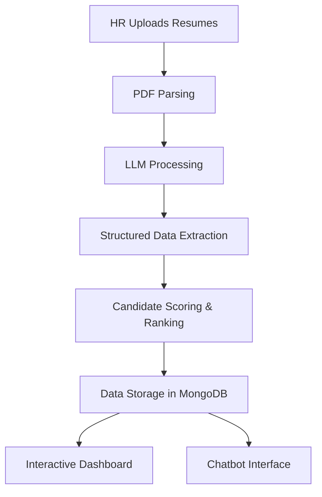

# Buildathon - Radons

* **Deployed Application**: [Link](#)
* **Demo Video**: [Link](#)
  
## Overview

* **Buildathon - Radons** is an AI-powered resume screening platform designed to streamline the recruitment process. 
* It enables HR professionals to upload resumes in PDF format, which are then processed by a Large Language Model (LLM) to extract and structure candidate information. 
* The system evaluates and ranks candidates based on their alignment with a given job description, presenting the results through an interactive analytics dashboard and a chatbot interface for efficient candidate assessment.

## Features

* **Resume Upload**: HR personnel can upload multiple resumes in PDF format.
* **LLM-Powered Parsing**: Utilizes advanced LLMs to extract and structure information from resumes.
* **Candidate Ranking**: Compares candidate profiles against job descriptions and assigns relevance scores.
* **Interactive Dashboard**: Visualizes candidate data and rankings for easy analysis.
* **Chatbot Interface**: Allows users to query candidate information conversationally.

## Tech Stack

* **Frontend**: React.js
* **Backend**: Node.js, Express.js
* **AI & NLP**: Python, OpenAI GPT (via Groq API), LangChain
* **Database**: MongoDB
* **PDF Processing**: PyPDF2
* **Data Visualization**: Chart.js, D3.js
* **Environment Management**: Python virtual environments, `.env` files

## System Architecture



## Getting Started

### Prerequisites

* Node.js and npm installed
* Python 3.8 or higher
* MongoDB instance running
* Groq API key for LLM access

### Installation

1. **Clone the repository**:

   ```bash
   git clone https://github.com/rakheshkrishna2005/Buildathon.git
   cd Buildathon
   ```

2. **Set up the backend**:

   ```bash
   cd backend
   python -m venv venv
   source venv/bin/activate  # On Windows: venv\Scripts\activate
   pip install -r requirements.txt
   ```

3. **Configure environment variables**:

   Create a `.env` file in the `backend` directory with the following content:

   ```env
   GROQ_API_KEY=your_groq_api_key
   MONGODB_URI=mongodb://localhost:27017/resume_ranking
   ```

4. **Run the backend server**:

   ```bash
   python app.py
   ```

5. **Set up the frontend**:

   ```bash
   cd ../frontend
   npm install
   npm start
   ```

   The application will be available at `http://localhost:3000`.

## Usage

1. **Upload Resumes**: Navigate to the upload section and select PDF resumes to upload.
2. **Processing**: The system parses the PDFs and extracts structured data using the LLM.
3. **Ranking**: Candidates are scored and ranked based on the provided job description.
4. **Dashboard**: View the interactive dashboard to analyze candidate rankings and details.
5. **Chatbot**: Use the chatbot interface to query specific information about candidates.
