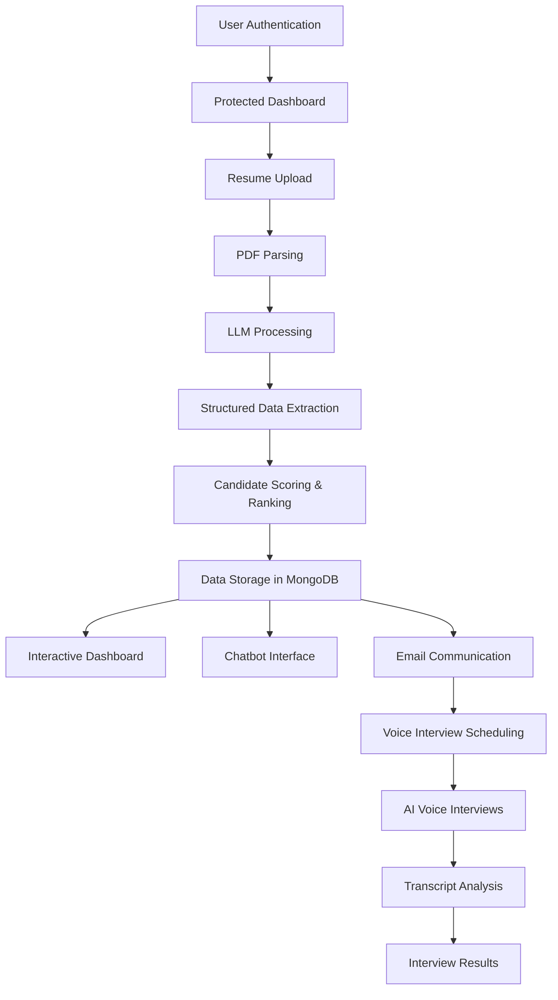

# Buildathon - Radons

* **Deployed Application**: [Link](https://hireai-radons-test.vercel.app/)
* **Demo Video**: [Link](https://drive.google.com/file/d/1n_Tq2703478Gb_oilc5n6Q7VNO_WE5Vy/view?usp=sharing)
  
## Overview

* **Buildathon - Radons** is an AI-powered resume screening platform designed to streamline the recruitment process. 
* It enables HR professionals to upload resumes in PDF format, which are then processed by a Large Language Model (LLM) to extract and structure candidate information. 
* The system evaluates and ranks candidates based on their alignment with a given job description, presenting the results through an interactive analytics dashboard and a chatbot interface for efficient candidate assessment.

## Features

### Core Features
* **Resume Upload**: HR personnel can upload multiple resumes in PDF format.
* **LLM-Powered Parsing**: Utilizes advanced LLMs to extract and structure information from resumes.
* **Candidate Ranking**: Compares candidate profiles against job descriptions and assigns relevance scores.
* **Interactive Dashboard**: Visualizes candidate data and rankings for easy analysis.
* **Chatbot Interface**: Allows users to query candidate information conversationally.

### New Features Added

#### 🔐 Authentication & Security
* **JWT-based Authentication**: Secure token-based authentication system
* **User Registration & Login**: Complete signup and login functionality
* **Protected Routes**: All sensitive pages require authentication
* **Password Security**: Bcrypt password hashing with validation
* **Token Management**: Automatic token validation and refresh
* **Input Validation**: Email format and password strength validation

#### 🎤 AI Voice Interviews
* **Automated Voice Interviews**: Conduct AI-powered voice interviews with candidates
* **Real-time Transcription**: Live conversation transcript with role-based grouping
* **Interview Scheduling**: Automated interview link generation and distribution
* **Transcript Analysis**: AI-powered evaluation of interview responses
* **Volume Visualization**: Real-time audio level indicators during interviews
* **Interview Completion Tracking**: Comprehensive interview session management

#### 📧 Email Communication System
* **Candidate Communication**: Send emails directly to candidates from the dashboard
* **Interview Invitations**: Automated email generation with voice interview links
* **Customizable Templates**: Personalized email content and subject lines
* **Interview Link Integration**: Seamless integration of voice interview scheduling
* **Email Tracking**: Success/failure notifications for email delivery

#### 📊 Enhanced Analytics Dashboard
* **Candidate Comparison**: Visual side-by-side candidate comparisons
* **Skill Distribution Analysis**: Interactive charts showing skill frequency
* **Performance Metrics**: Detailed scoring and ranking analytics
* **Pipeline Insights**: Hiring funnel visualization and tracking
* **Search & Filter**: Advanced filtering by skills, scores, and other criteria
* **Export Functionality**: Download candidate data and reports

#### 🤖 Conversational AI Assistant
* **Natural Language Queries**: Ask questions about candidates in plain English
* **Smart Filtering**: Intelligent search across candidate database
* **Instant Answers**: Real-time responses to candidate-related questions
* **Context-Aware Responses**: AI understands hiring context and requirements

## Tech Stack

* **Frontend**: React.js, Vite, Tailwind CSS
* **Backend**: Python Flask, Node.js, Express.js
* **AI & NLP**: OpenAI GPT (via Groq API), LangChain, Vapi AI
* **Database**: MongoDB
* **PDF Processing**: PyPDF2
* **Authentication**: JWT, bcrypt
* **Voice Processing**: Vapi AI Web SDK
* **Email Services**: Custom mail server integration
* **Data Visualization**: Chart.js, D3.js, Recharts
* **Environment Management**: Python virtual environments, `.env` files

## System Architecture



## Getting Started

### Prerequisites

* Node.js and npm installed
* Python 3.8 or higher
* MongoDB instance running
* Groq API key for LLM access
* Vapi AI credentials for voice interviews

### Installation

1. **Clone the repository**:

   ```bash
   git clone https://github.com/rakheshkrishna2005/Buildathon.git
   cd Buildathon
   ```

2. **Set up the backend**:

   ```bash
   cd backend
   python -m venv venv
   source venv/bin/activate  # On Windows: venv\Scripts\activate
   pip install -r requirements.txt
   ```

3. **Configure environment variables**:

   Create a `.env` file in the `backend` directory with the following content:

   ```env
   GROQ_API_KEY=your_groq_api_key
   MONGODB_URI=mongodb://localhost:27017/resume_ranking
   JWT_SECRET=your_super_secret_jwt_key_here
   FLASK_ENV=development
   FLASK_DEBUG=True
   ```

4. **Run the backend server**:

   ```bash
   python app.py
   ```

5. **Set up the frontend**:

   ```bash
   cd ../frontend
   npm install
   ```

6. **Configure frontend environment**:

   Create a `.env` file in the `frontend` directory:

   ```env
   VITE_VAPI_PUBLIC_KEY=your_vapi_public_key_here
   VITE_VAPI_ASSISTANT_ID=your_vapi_assistant_id_here
   VITE_API_BASE_URL=http://localhost:5000/api
   VITE_DEV_MODE=true
   ```

7. **Start the frontend development server**:

   ```bash
   npm run dev
   ```

   The application will be available at `http://localhost:5173`.

## Usage

### Authentication
1. **Sign Up**: Create a new account with email and password
2. **Login**: Access your secure dashboard with authentication
3. **Protected Access**: All sensitive features require authentication

### Resume Processing
1. **Upload Resumes**: Navigate to the upload section and select PDF resumes to upload
2. **Processing**: The system parses the PDFs and extracts structured data using the LLM
3. **Ranking**: Candidates are scored and ranked based on the provided job description

### Candidate Management
1. **Dashboard**: View the interactive dashboard to analyze candidate rankings and details
2. **Candidate Details**: Click on candidates to view detailed profiles and analytics
3. **Search & Filter**: Use advanced filtering to find specific candidates
4. **Email Communication**: Send emails to candidates with optional interview invitations

### Voice Interviews
1. **Interview Scheduling**: Generate interview links for candidates via email
2. **Conduct Interviews**: Use the AI voice interview interface for automated interviews
3. **Real-time Analysis**: Monitor interview progress with live transcription
4. **Results Review**: Analyze interview transcripts and evaluation results

### AI Assistant
1. **Natural Queries**: Ask questions about candidates using natural language
2. **Smart Search**: Use conversational queries to filter and find candidates
3. **Instant Insights**: Get immediate answers about candidate qualifications and fit

## Security Features

* **JWT Authentication**: Secure token-based authentication
* **Password Hashing**: Bcrypt encryption for password security
* **Protected Routes**: All sensitive endpoints require authentication
* **Input Validation**: Comprehensive validation for all user inputs
* **Environment Security**: Secure configuration management
* **CORS Protection**: Cross-origin request security

## API Endpoints

### Authentication
- `POST /api/signup` - User registration
- `POST /api/login` - User authentication
- `GET /api/validate` - Token validation

### Protected Endpoints
- `GET /api/candidates` - Get all candidates
- `POST /api/upload` - Upload resume file
- `POST /api/analyze_resumes` - Process resume batch
- `GET /api/status/:sessionId` - Check processing status
- `GET /api/result/:sessionId` - Get processing results
- `POST /api/chat/:sessionId` - Chat with session data

## Contributing

1. Fork the repository
2. Create a feature branch
3. Make your changes
4. Test thoroughly
5. Submit a pull request

## License

This project is licensed under the MIT License - see the LICENSE file for details.
